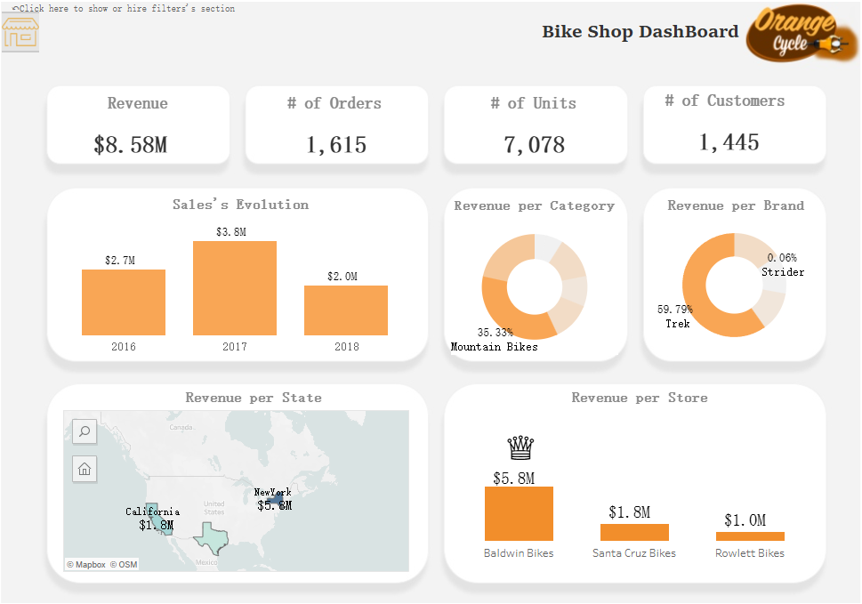
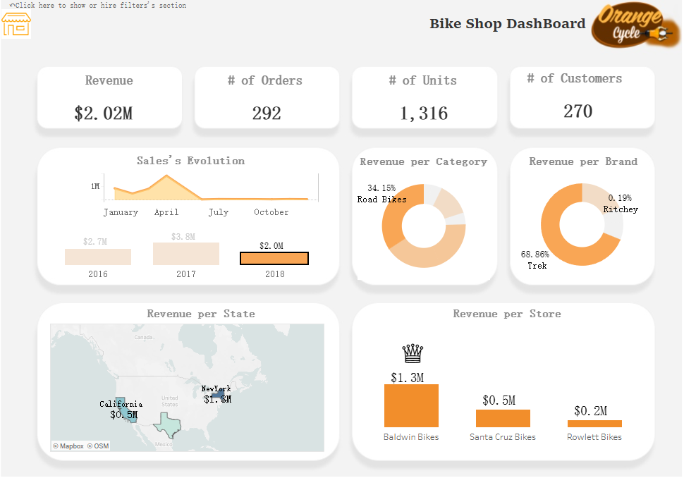

# Bike-Shop-Dashboard-PostgreSQL-Tableau

## Business Request & User Stories
The busisness request for this data analyst project was an executive sales report for the sales managers. 
Based on the request that was made from the business, user stories were defined to fulfill delivery and ensure that criteria's were maintained throughout the project.

**User**: Sale Manager, Sales Representative.

**Resquest**: Know the condition of the sales activities within the company over the 2016 to 2018 period.

They want to get a dashboard overview of sales over 3 year and a detailed overview of sale per year, per brand and per state.

**Values**:
- Can follow sales over time.
- Can follow up which product's category and brand sells the most.
- Can follow up which state and store that have the best revenue.

## Data Used

**Data** - Sales Data of Bike Shop from the year 2016 to 2018.

**Data Cleaning & Analysis** - PostgreSQL
https://github.com/Kim-ngoc2710/Portfolio

**Data Visualization** - Tableau Desktop
https://public.tableau.com/app/profile/kim.ngoc.pham2307/viz/BikeStoreDashboard_17198522184100/Dashboard1

## Summary of Findings

**We can observe trends of growth and decline in sales over the three years from 2016 to 2018.**

**2018 witnessed a significant drop in revenue.**

- Starting from June 2018, the revenue plummeted to just 1/20 of the average annual revenue. Notably, the revenue in June was only $210.
- From June onwards, the number of orders fluctuated between 1 to 5 orders per month. Some stores in various cities had almost no orders throughout the entire month.
- Although New York was the city that generated the highest revenue for the business, both July and October did not produce any revenue.
